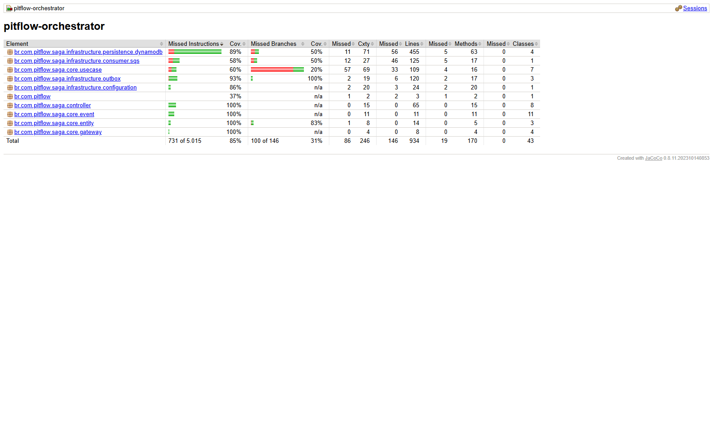

# PitFlow Orchestrator

Microsserviço responsável por coordenar a SAGA de pagamento das ordens de
serviço. Ele mantém o estado e o histórico da SAGA no DynamoDB, consome eventos
de negócio, publica comandos para Operation e Payment e decide quando o fluxo
termina em `COMPLETED` ou `FAILED`.

## Por que a SAGA é orquestrada

O fluxo atravessa Operation, Payment, Mercado Pago, PostgreSQL, DynamoDB e SQS.
Não existe uma transação ACID única capaz de confirmar ou desfazer todos esses
recursos.

Foi escolhida uma **SAGA orquestrada** porque:

- o estado e as transições do processo ficam explícitos em uma máquina de
  estados central;
- o caminho feliz e as compensações são auditáveis por `sagaId`,
  `serviceOrderId`, histórico e traces;
- regras de timeout, retry, evento fora de ordem e estado terminal ficam em um
  único proprietário;
- Operation e Payment permanecem responsáveis apenas por suas transações
  locais;
- o fluxo é mais simples de demonstrar e operar do que uma coreografia em que
  cada serviço precisa conhecer implicitamente a próxima etapa.

O Orchestrator não acessa bancos de outros serviços. Ele coordena por mensagens
e persiste somente seus próprios dados no DynamoDB.

## Visão global do ambiente

O PitFlow está dividido por capacidade de negócio e cada serviço possui
persistência e pipeline independentes:

| Componente | Responsabilidade | Persistência/interface |
|---|---|---|
| Registry | clientes, veículos e mecânicos/autenticação | PostgreSQL e REST |
| Inventory | serviços e itens de estoque | PostgreSQL e REST |
| Operation | ciclo da ordem de serviço e notificações | PostgreSQL, REST e SQS |
| Payment | intenção financeira, Checkout Pro e webhook | PostgreSQL, SQS e webhook REST |
| Orchestrator | estado, comandos e compensações da SAGA | DynamoDB e SQS |
| Bootstrap | infraestrutura compartilhada e contratos | Terraform, Kubernetes e AsyncAPI |

```text
Cliente/Swagger
      |
 API Gateway
      |
      +--> Registry --------> PostgreSQL Registry
      +--> Inventory -------> PostgreSQL Inventory
      +--> Operation -------> PostgreSQL Operation
      +--> Payment ---------> PostgreSQL Payment + Mercado Pago
                                |
Operation/Payment --eventos--> SQS orchestrator queue
                                |
                         Orchestrator
                         |          |
                    DynamoDB     comandos SQS
                                  |       |
                              Payment  Operation
```

As APIs públicas entram pelo API Gateway. O Orchestrator não oferece API de
negócio pública: ele é acionado pela fila de eventos e responde por filas de
comandos. Os contratos ficam centralizados no Bootstrap, mas a implementação e
o deploy continuam independentes por repositório.

## Por que a comunicação usa Amazon SQS

Foi escolhida a **Amazon SQS Standard** para comandos e eventos assíncronos
porque ela:

- desacopla a disponibilidade dos serviços;
- oferece serviço gerenciado compatível com o ambiente AWS do projeto;
- permite retry, long polling e DLQ sem operar um broker próprio;
- suporta a escala independente dos consumidores;
- integra-se diretamente à infraestrutura, IAM e observabilidade já adotadas.

SQS Standard possui entrega **pelo menos uma vez** e pode entregar mensagens
duplicadas ou fora de ordem. Por isso, a solução não depende de entrega
exatamente uma vez:

- cada envelope possui `messageId`, `correlationId`, `sagaId`,
  `serviceOrderId`, `schemaVersion`, `type` e `occurredAt`;
- consumidores registram inbox/idempotência por `messageId`;
- publishers utilizam transactional outbox;
- transições usam condições de estado e versionamento otimista;
- mensagens incompatíveis com o estado atual não avançam a SAGA;
- falhas transitórias são reenviadas e falhas persistentes seguem para DLQ
  após `maxReceiveCount=5`.

### Filas

| Fila | Direção principal | Exemplos |
|---|---|---|
| `service-order-orchestrator-queue` | Serviços → Orchestrator | `ServiceOrderBudgetApproved`, `PaymentLinkCreated`, `PaymentApproved`, `PaymentRejected`, confirmações do Operation |
| `payment-command-queue` | Orchestrator → Payment | `CreatePayment` |
| `operation-command-queue` | Orchestrator → Operation | `MarkServiceOrderAwaitingPayment`, `MarkServiceOrderReadyForExecution`, `CancelServiceOrder` |

Cada fila principal possui sua própria DLQ.

## Fluxo principal

```text
ServiceOrderBudgetApproved
  -> CreatePayment
  -> PaymentLinkCreated
  -> MarkServiceOrderAwaitingPayment
  -> ServiceOrderAwaitingPayment
  -> PaymentApproved
  -> MarkServiceOrderReadyForExecution
  -> ServiceOrderReadyForExecution
  -> SAGA COMPLETED
```

O recebimento de `PaymentApproved` não conclui a SAGA. O estado só chega a
`COMPLETED` depois que o Operation confirma
`ServiceOrderReadyForExecution`.

## Compensação homologada

```text
PaymentRejected
  -> SAGA COMPENSATING
  -> CancelServiceOrder
  -> Operation CANCELLED
  -> ServiceOrderCancelled
  -> SAGA FAILED
```

A compensação desfaz semanticamente o processo distribuído; ela não executa
rollback físico em bancos alheios. Cada serviço confirma sua própria transação
local e publica o resultado para que o Orchestrator avance a máquina de estados.

Esse cenário está coberto pelo BDD E2E do `pitflow-payment`, que comprovou
Payment `REJECTED`, Operation `CANCELLED`, SAGA `FAILED` e replay idempotente.

## Persistência confiável

O Orchestrator usa DynamoDB single-table:

- `SAGA`: estado e correlação;
- `HISTORY`: transições imutáveis;
- `INBOX`: deduplicação;
- `OUTBOX`: publicação confiável com claim, lease e retry;
- `ACTIVE_SAGA`: unicidade de SAGA ativa por ordem.

Atualizações relacionadas são realizadas com escritas condicionais e
`TransactWriteItems`. Consulte [o modelo DynamoDB](docs/DYNAMODB_DATA_MODEL.md).

Operation e Payment usam PostgreSQL com transactional outbox. Assim, a mudança
de negócio e o evento são persistidos na mesma transação local; um publisher
posterior entrega o evento ao SQS.

## Alternativas consideradas

- **SAGA coreografada:** descartada porque distribuiria as regras de sequência
  e compensação entre serviços, dificultando auditoria, testes e operação.
- **Chamadas HTTP síncronas para todo o fluxo:** descartadas por acoplar a
  disponibilidade dos serviços e aumentar o risco de estado parcial.
- **SQS FIFO:** não foi necessária para o MVP; FIFO não elimina a necessidade
  de idempotência, e a máquina de estados já rejeita duplicatas e eventos fora
  de ordem.
- **Broker autogerenciado:** descartado pelo custo operacional desnecessário no
  AWS Learner Lab.

## Contratos e decisão arquitetural

- [ADR canônico — SAGA orquestrada e mensageria do pagamento](https://github.com/pitflow-so/pitflow-bootstrap/blob/main/docs/adr/ADR-001-saga-messaging.md)
- [Contrato AsyncAPI da SAGA](https://github.com/pitflow-so/pitflow-bootstrap/blob/main/contracts/asyncapi/pitflow-saga-v1.yaml)
- [Modelo de dados DynamoDB](docs/DYNAMODB_DATA_MODEL.md)

## Tecnologias

- Java 21;
- Spring Boot 4;
- Maven;
- AWS SDK para DynamoDB e SQS;
- DynamoDB single-table;
- Amazon SQS Standard e DLQs;
- Docker e Kubernetes/EKS;
- JaCoCo;
- GitHub Actions;
- Datadog no ambiente Kubernetes.

## Pré-requisitos

Para compilar e testar:

- JDK 21;
- Maven 3.9 ou compatível.

Para executar o fluxo completo localmente:

- credenciais AWS válidas na cadeia padrão do SDK, por perfil ou variáveis de
  ambiente;
- tabela DynamoDB `pitflow-orchestrator`;
- filas `service-order-orchestrator-queue`, `payment-command-queue` e
  `operation-command-queue`;
- permissões para ler/apagar mensagens da fila de entrada, publicar nas filas
  de comandos e ler/escrever na tabela.

AWS CLI e Docker são opcionais, mas úteis para validar credenciais, recursos e
imagem.

## Configuração

| Variável | Padrão | Finalidade |
|---|---|---|
| `AWS_REGION` | `us-east-1` | Região dos recursos AWS |
| `ORCHESTRATOR_TABLE_NAME` | `pitflow-orchestrator` | Tabela DynamoDB |
| `ORCHESTRATOR_QUEUE_NAME` | `service-order-orchestrator-queue` | Fila consumida pelo Orchestrator |
| `PAYMENT_COMMAND_QUEUE_NAME` | `payment-command-queue` | Comandos enviados ao Payment |
| `OPERATION_COMMAND_QUEUE_NAME` | `operation-command-queue` | Comandos enviados ao Operation |
| `ORCHESTRATOR_CONSUMER_ENABLED` | `true` | Habilita o polling da fila de entrada |
| `ORCHESTRATOR_CONSUMER_DELAY_MS` | `1000` | Intervalo mínimo entre ciclos do consumer |
| `ORCHESTRATOR_CONSUMER_WAIT_SECONDS` | `20` | Long polling do SQS |
| `ORCHESTRATOR_OUTBOX_ENABLED` | `true` | Habilita publicação da outbox |
| `ORCHESTRATOR_OUTBOX_DELAY_MS` | `5000` | Intervalo entre ciclos da outbox |
| `ORCHESTRATOR_OUTBOX_BATCH_SIZE` | `10` | Itens processados por lote |
| `ORCHESTRATOR_OUTBOX_LEASE_SECONDS` | `60` | Duração do claim de publicação |
| `ORCHESTRATOR_OUTBOX_MAX_BACKOFF_SECONDS` | `300` | Limite do backoff |

Credenciais seguem a cadeia padrão do AWS SDK, como `AWS_PROFILE`,
`AWS_ACCESS_KEY_ID`, `AWS_SECRET_ACCESS_KEY` e `AWS_SESSION_TOKEN`. Nunca
versione seus valores.

## Compilar e testar

```bash
mvn -B clean verify
```

O relatório HTML local é gerado em:

```text
target/site/jacoco/index.html
```

Esse arquivo pertence ao diretório de build e não é versionado. Para consultá-lo,
execute primeiro `mvn -B clean verify` e abra o arquivo no navegador. No GitHub
Actions, o mesmo relatório fica disponível para download no artefato da
execução.

O `verify` executa 29 testes. O JaCoCo interrompe o build se a cobertura total
de linhas ficar abaixo de 80%.

Cobertura validada em 27/07/2026:

| Métrica | Cobertura |
|---|---:|
| Linhas | 84,37% (788/934) |
| Instruções | 85,42% (4.284/5.015) |
| Branches | 31,51% (46/146) |

A CI publica o relatório completo no artefato
`orchestrator-jacoco-<commit-sha>`, disponível por 14 dias.

[Abrir a evidência versionada da cobertura](./docs/evidencias/cobertura-jacoco.png)



Para iniciar sem consumir mensagens nem publicar a outbox, use o modo de smoke
test:

### Bash

```bash
export ORCHESTRATOR_CONSUMER_ENABLED=false
export ORCHESTRATOR_OUTBOX_ENABLED=false
mvn spring-boot:run
```

### PowerShell

```powershell
$env:ORCHESTRATOR_CONSUMER_ENABLED = "false"
$env:ORCHESTRATOR_OUTBOX_ENABLED = "false"
mvn spring-boot:run
```

Nesse modo a aplicação deve responder:

```bash
curl http://localhost:8080/orchestrator/actuator/health
```

Resposta esperada:

```json
{"status":"UP"}
```

O serviço não expõe API REST de negócio nem Swagger. Sua interface de negócio é
assíncrona por SQS; HTTP é usado somente para health/info do Actuator.

## Executar localmente com AWS

Valide primeiro a identidade:

```bash
aws sts get-caller-identity
```

Configure o perfil ou as credenciais temporárias e execute:

### Bash

```bash
export AWS_PROFILE="pitflow"
export AWS_REGION="us-east-1"
export ORCHESTRATOR_TABLE_NAME="pitflow-orchestrator"
export ORCHESTRATOR_QUEUE_NAME="service-order-orchestrator-queue"
export PAYMENT_COMMAND_QUEUE_NAME="payment-command-queue"
export OPERATION_COMMAND_QUEUE_NAME="operation-command-queue"

mvn spring-boot:run
```

### PowerShell

```powershell
$env:AWS_PROFILE = "pitflow"
$env:AWS_REGION = "us-east-1"
$env:ORCHESTRATOR_TABLE_NAME = "pitflow-orchestrator"
$env:ORCHESTRATOR_QUEUE_NAME = "service-order-orchestrator-queue"
$env:PAYMENT_COMMAND_QUEUE_NAME = "payment-command-queue"
$env:OPERATION_COMMAND_QUEUE_NAME = "operation-command-queue"

mvn spring-boot:run
```

Ao executar contra filas compartilhadas, o processo passa a ser um consumidor
real. Não mantenha simultaneamente uma instância local e outra remota consumindo
o mesmo cenário quando precisar de uma demonstração determinística.

## Docker

Construir a imagem:

```bash
docker build -t pitflow-orchestrator:local .
```

Smoke test sem acesso à AWS:

```bash
docker run --rm -p 8080:8080 \
  -e ORCHESTRATOR_CONSUMER_ENABLED=false \
  -e ORCHESTRATOR_OUTBOX_ENABLED=false \
  pitflow-orchestrator:local
```

Para usar AWS, forneça as variáveis temporárias ao container por um mecanismo
seguro do ambiente. Não grave credenciais no Dockerfile, na imagem ou em arquivo
versionado.

## Estrutura principal

```text
src/main/java/br/com/pitflow/saga
├── controller       # entrada dos eventos na aplicação
├── core             # entidades, portas e casos de uso
└── infrastructure
    ├── consumer/sqs # polling e roteamento dos eventos
    ├── outbox       # publicação confiável de comandos
    └── persistence  # adapters DynamoDB
```

Os manifests estão em `infra/k8s`, e o modelo single-table está documentado em
[`docs/DYNAMODB_DATA_MODEL.md`](docs/DYNAMODB_DATA_MODEL.md).

## CI/CD e Kubernetes

O workflow independente executa:

1. checkout;
2. configuração do Java 21;
3. `mvn -B clean verify`, incluindo o gate de 80%;
4. publicação do relatório JaCoCo;
5. reutilização da imagem imutável do commit ou build e publicação no ECR;
6. aplicação dos manifests no namespace `pitflow`;
7. espera pelo rollout.

O deploy ocorre em push para `main` ou por `workflow_dispatch`. Configurações de
plataforma são lidas do AWS Secrets Manager e não ficam no repositório.

Com acesso ao cluster:

```bash
kubectl get pods -n pitflow -l app.kubernetes.io/name=pitflow-orchestrator
kubectl rollout status deployment/pitflow-orchestrator -n pitflow
kubectl logs -n pitflow deployment/pitflow-orchestrator --tail=200
```

Health interno:

```text
/orchestrator/actuator/health
```

## Problemas comuns

- `ExpiredToken` ou `InvalidClientTokenId`: renove as credenciais temporárias
  e o `AWS_SESSION_TOKEN`;
- `ResourceNotFoundException`: confira região, tabela e nomes das filas;
- `AccessDeniedException`: revise permissões DynamoDB/SQS da identidade;
- mensagens repetidas: comportamento possível do SQS Standard; confirme inbox,
  `messageId` e transições idempotentes;
- evento não avança a SAGA: confira tipo, versão do envelope, ordem lógica e
  estado atual;
- aplicação local consumindo mensagens inesperadamente: inicie com consumer e
  outbox desabilitados.

## Limites

O endpoint acadêmico usado para provocar rejeição pertence ao Payment e deve ser
removido ou condicionado por perfil antes de uso comercial. Evoluções como
expiração, estorno, reconciliação e notificação dedicada não fazem parte do
recorte mínimo homologado.
